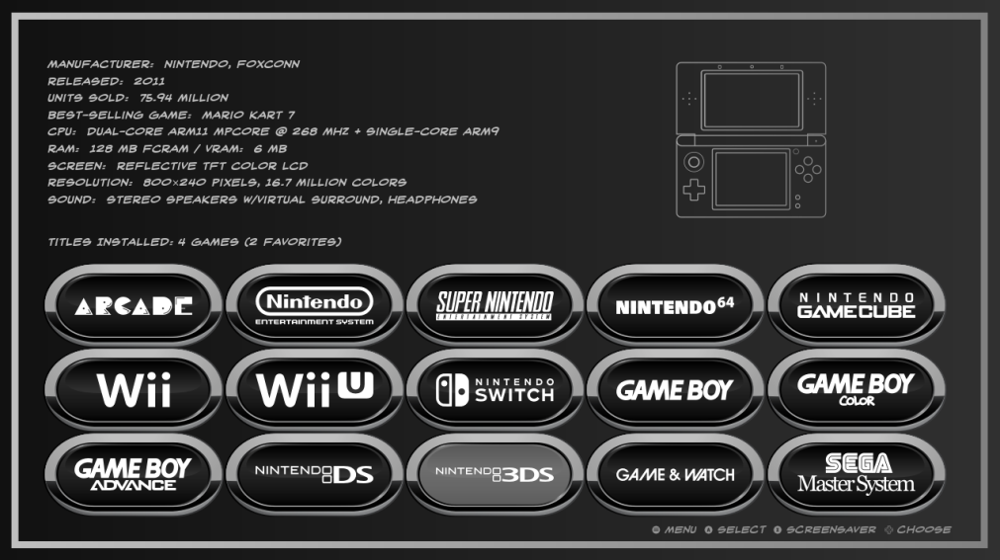
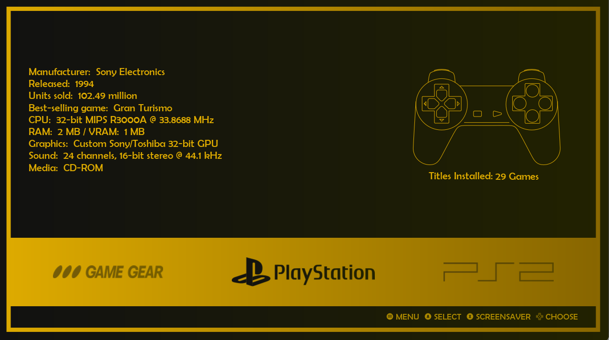
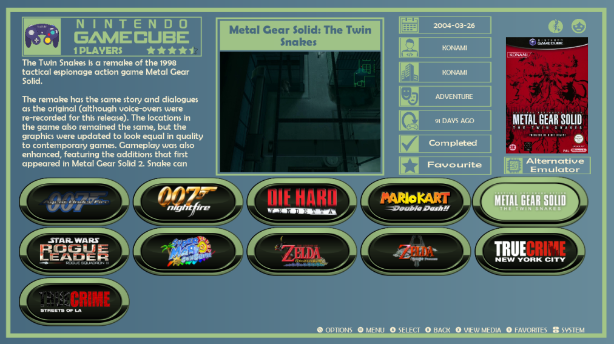
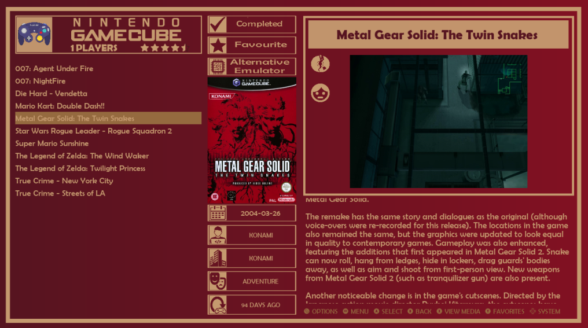

# TexGriddy-es-de for EmulationStation Desktop Edition

Texgriddy-es-de is a theme set for ES-DE that supports all systems as well as the latest application features.

The following options are included:

4 variants:

- Grid with videos
- Grid without videos
- Carousel/Textlist with videos
- Carousel/Textlist without videos

8 color schemes:

- Chilled
- Gold
- Greyscale
- Retro
- Purple Rain
- Primary
- Stay Classy
- Blue

4 aspect ratios:

- 16:9
- 4:3
- 16:10
- 21:9

